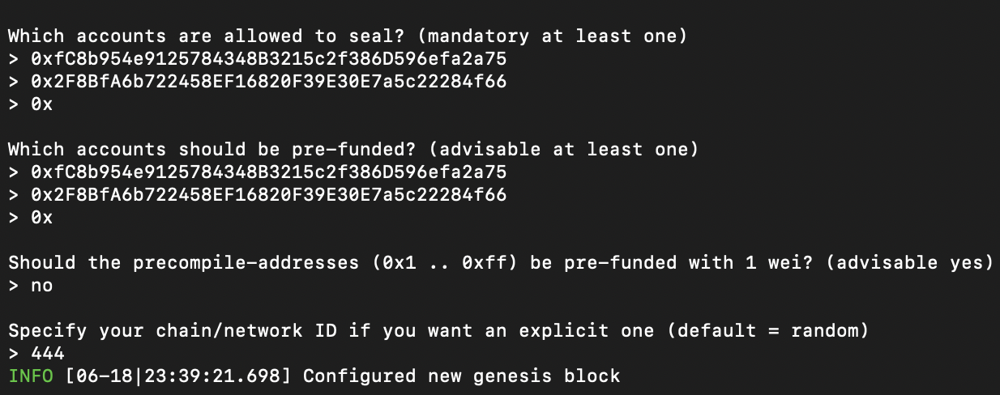

# Proof of Authority Development Chain

# Activating Nodes

## Public Address for Nodes 1 and 2 are provided below.

Public Address Node 1: 0xfC8b954e9125784348B3215c2f386D596efa2a75
Public Address Node 2: 0x2F8BfA6b722458EF16820F39E30E7a5c22284f66

When working through this notebook be sure to create your own public address using geth by running 

./geth --datadir node1 account new
./geth --datadir node2 account new

This was you will have your own set of passwords for each node

Each Node is pre-funded during the genesis block configuration. 

### Initializing Node 1

### Initializing Node 2

Nodes intnialized using 

./geth --datadir node1 init \poatnet.json
./geth --datadir node2 init \poatnet.json

* json file provided above

## To unlock and reactive  nodes 1 and 2 from geth run the below lines of code

### Node 1

./geth --datadir node1 --unlock "fC8b954e9125784348B3215c2f386D596efa2a75" --mine --rpc --allow-insecure-unlock

### Node 2
./geth --datadir node2 --unlock "2F8BfA6b722458EF16820F39E30E7a5c22284f66" --mine --port 30304 --bootnodes "enode://c523ad3cc56f6776461c49a4b0b00caab1fa6fd27b13d2624d792513fbf8c2ada02ebdbba146aa32d9e47587fbddf7cbfe0915f5873188662fa00fc0e974ae61@127.0.0.1:30303" --ipcdisable --allow-insecure-unlock

* Where  "fC8b954e9125784348B3215c2f386D596efa2a75" is the Sealer 1 addres and "2F8BfA6b722458EF16820F39E30E7a5c22284f66" is the Sealer 2 address 
* c523ad3cc56f6776461c49a4b0b00caab1fa6fd27b13d2624d792513fbf8c2ada02ebdbba146aa32d9e47587fbddf7cbfe0915f5873188662fa00fc0e974ae61@127.0.0.1:30303 is the Sealer 1 encoded address produced after Node 1 is activated 

* Be sure to type your password in for both nodes 

### Running Nodes 1 & 2. Both nodes should be mining 

4.Node1&2-mining.png

# My Crypto Transcations 

### Open MyCrypto and create new custom node

* Type ETH in the Currency box.

* In the Chain ID box, type the chain id you generated during genesis creation (444). 

* In the URL box type: http://127.0.0.1:8545.  This points to the default RPC port on your local machine.

* Finally, click Save & Use Custom Node.

### Access wallet using Keystore File 

 Select Wallet File, then navigate to the keystore directory inside your Node1 directory (provided above) select the file located there, provide your password when prompted and then click Unlock.
 
 
